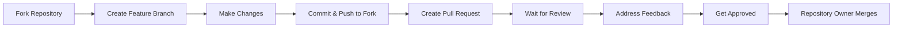
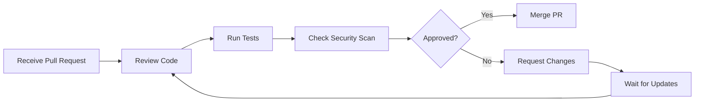

# 🛡️ GitHub Repository Setup Guide

This guide explains how to configure your GitHub repository to enforce the access control policies where only you can edit code directly.

## 🔐 Repository Settings Configuration

### **1. Repository Access Settings**

#### **Collaborators & Teams**
- **Settings** → **Collaborators and teams**
- **Add people**: Only add users as **Read** access
- **No write access** for any external users
- **Only you** should have **Admin** or **Write** access

#### **Branches Protection Rules**
- **Settings** → **Branches** → **Add rule**
- **Branch name pattern**: `main`
- **Protect matching branches**: ✅ Checked

**Required Settings:**
- ✅ **Require a pull request before merging**
- ✅ **Require approvals**: Set to **1** (your approval)
- ✅ **Dismiss stale PR approvals when new commits are pushed**
- ✅ **Require status checks to pass before merging**
- ✅ **Require branches to be up to date before merging**
- ✅ **Restrict pushes that create files that use the Git LFS**
- ✅ **Restrict deletions**

**Status Checks:**
- ✅ **Require status checks to pass before merging**
- ✅ **Require branches to be up to date before merging**
- ✅ **Status checks that are required**: Add your CI/CD workflows

### **2. Security Settings**

#### **Security & Analysis**
- **Settings** → **Security & analysis**
- ✅ **Dependency graph**: Enabled
- ✅ **Dependabot alerts**: Enabled
- ✅ **Dependabot security updates**: Enabled
- ✅ **Code scanning**: Enabled (GitHub Advanced Security)
- ✅ **Secret scanning**: Enabled

#### **Code Security and Analysis**
- **Settings** → **Code security and analysis**
- ✅ **Enable GitHub Advanced Security features**
- ✅ **Enable secret scanning**
- ✅ **Enable push protection**

### **3. Actions Settings**

#### **Actions Permissions**
- **Settings** → **Actions** → **General**
- **Actions permissions**: **Allow select actions**
- **Workflow permissions**: **Read and write permissions**
- ✅ **Allow GitHub Actions to create and approve pull requests**

#### **Required Workflows**
Ensure these workflows are enabled:
- `security-scan.yml` - Security vulnerability scanning
- `code-quality.yml` - Code quality checks
- `dependency-update.yml` - Dependency update monitoring

### **4. Issue and Pull Request Settings**

#### **Issues**
- **Settings** → **Features**
- ✅ **Issues**: Enabled
- ✅ **Allow forking**: Enabled
- ✅ **Allow forking**: **Allow forking**

#### **Pull Requests**
- **Settings** → **Pull Requests**
- ✅ **Allow squash merging**
- ✅ **Allow merge commits**
- ❌ **Allow rebase merging** (optional)
- ✅ **Automatically delete head branches**

### **5. Webhooks (Optional)**

#### **Webhook Configuration**
- **Settings** → **Webhooks**
- **Add webhook** for external integrations
- **Payload URL**: Your external service URL
- **Content type**: `application/json`
- **Events**: Select relevant events

## 🔒 Access Control Matrix

| User Type | View Code | Fork Repo | Create Issues | Submit PRs | Merge PRs | Direct Push |
|-----------|-----------|-----------|---------------|------------|-----------|-------------|
| **Public Users** | ✅ | ✅ | ✅ | ✅ | ❌ | ❌ |
| **Repository Owner (You)** | ✅ | ✅ | ✅ | ✅ | ✅ | ✅ |
| **Collaborators** | ✅ | ✅ | ✅ | ✅ | ❌ | ❌ |

## 🚫 What Users Cannot Do

### **Direct Code Changes**
- ❌ Push directly to main branch
- ❌ Create branches in your repository
- ❌ Force push to any branch
- ❌ Delete branches
- ❌ Modify repository settings

### **Repository Management**
- ❌ Change repository visibility
- ❌ Transfer repository ownership
- ❌ Delete repository
- ❌ Modify branch protection rules

## ✅ What Users Can Do

### **Code Interaction**
- ✅ View all source code
- ✅ Download code as ZIP
- ✅ Clone repository
- ✅ Fork repository to their account
- ✅ Create issues and discussions
- ✅ Submit pull requests

### **Collaboration**
- ✅ Comment on issues and PRs
- ✅ Request reviews
- ✅ Participate in discussions
- ✅ Report bugs and suggest features

## 🔄 Workflow for Code Changes

### **For Users (Contributors):**

### **For You (Repository Owner):**

## 🛡️ Security Best Practices

### **Repository Security**
- ✅ Enable branch protection rules
- ✅ Require pull request reviews
- ✅ Enable security scanning
- ✅ Monitor dependency vulnerabilities
- ✅ Regular security audits

### **Access Management**
- ✅ Regular review of collaborators
- ✅ Monitor repository activity
- ✅ Audit log review
- ✅ Remove unused access

## 📋 Setup Checklist

### **Repository Settings**
- [ ] Set repository to **Public** or **Private** as needed
- [ ] Configure branch protection for `main` branch
- [ ] Enable required status checks
- [ ] Set up required pull request reviews
- [ ] Configure security and analysis features

### **Actions & Automation**
- [ ] Enable GitHub Actions
- [ ] Configure security scanning workflows
- [ ] Set up dependency update monitoring
- [ ] Configure code quality checks

### **Access Control**
- [ ] Review and remove unnecessary collaborators
- [ ] Set appropriate permissions for teams
- [ ] Configure webhook security
- [ ] Test pull request workflow

### **Documentation**
- [ ] Update README with contribution guidelines
- [ ] Create CONTRIBUTING.md
- [ ] Set up issue templates
- [ ] Configure pull request templates

## 🚨 Troubleshooting

### **Common Issues**

#### **Users Can't Fork Repository**
- Check repository visibility settings
- Ensure forking is enabled in repository settings
- Verify user has internet access to GitHub

#### **Pull Requests Not Being Created**
- Check if user has forked the repository
- Verify branch protection rules are not too restrictive
- Ensure required status checks are passing

#### **Security Scans Failing**
- Check GitHub Actions permissions
- Verify required secrets are configured
- Review workflow configuration

#### **Branch Protection Issues**
- Ensure you have admin access to repository
- Check if branch protection rules are properly configured
- Verify required status checks are enabled

## 📞 Support

If you encounter issues with repository setup:

1. **Check GitHub Documentation**: [GitHub Help](https://help.github.com/)
2. **Review Repository Settings**: Go through each setting systematically
3. **Test with Test Account**: Create a test account to verify permissions
4. **Contact GitHub Support**: For complex issues

---

**Remember**: The goal is to allow collaboration while maintaining code quality and security. Users can contribute through the proper channels (issues, discussions, pull requests) while you maintain full control over what gets merged into your codebase.
