# 📚 BookStore Application - Complete User Flow Documentation

## 🎯 **Overview**

This document provides a comprehensive guide to how requests flow through the BookStore application, from the frontend user interface to the database and back. It covers all major user flows including authentication, book management, order processing, and real-time notifications.

---

## 🏗️ **Application Architecture Overview**

```
┌─────────────────────────────────────────────────────────────────────────────────┐
│                                REQUEST FLOW LAYERS                             │
├─────────────────────────────────────────────────────────────────────────────────┤
│  🌐 Frontend (React)     │  🔒 Security Layer    │  🎯 Controller Layer        │
│  ├── User Interface      │  ├── JWT Validation   │  ├── REST Endpoints         │
│  ├── Context API         │  ├── OAuth2           │  ├── Request Validation     │
│  ├── API Calls           │  ├── Role-based Auth  │  └── Response Handling      │
│  └── WebSocket Client    │  └── CORS Config      │                             │
├─────────────────────────────────────────────────────────────────────────────────┤
│  🔧 Service Layer        │  📊 Repository Layer  │  🗄️ Database Layer          │
│  ├── Business Logic      │  ├── Data Access      │  ├── PostgreSQL             │
│  ├── Transaction Mgmt    │  ├── Query Methods    │  ├── Entity Relationships   │
│  ├── Event Publishing    │  └── Custom Queries   │  └── Data Persistence       │
│  └── Saga Coordination   │                       │                             │
├─────────────────────────────────────────────────────────────────────────────────┤
│  🔄 Event-Driven Layer   │  📡 External Services │  📱 Real-time Layer         │
│  ├── Kafka Events (Optional)│  ├── AWS S3 Storage (Optional)│  ├── WebSocket Server       │
│  ├── Event Consumers     │  ├── Stripe Payment (Optional)│  ├── STOMP Protocol         │
│  ├── Saga Pattern        │  ├── Google OAuth2 (Optional)│  └── Real-time Notifications│
│  └── Compensation Logic  │  └── Email Service (Optional)│                             │
└─────────────────────────────────────────────────────────────────────────────────┘
```

---

## 🔐 **Flow 1: User Authentication & Registration**

### **1.1 User Registration Flow**

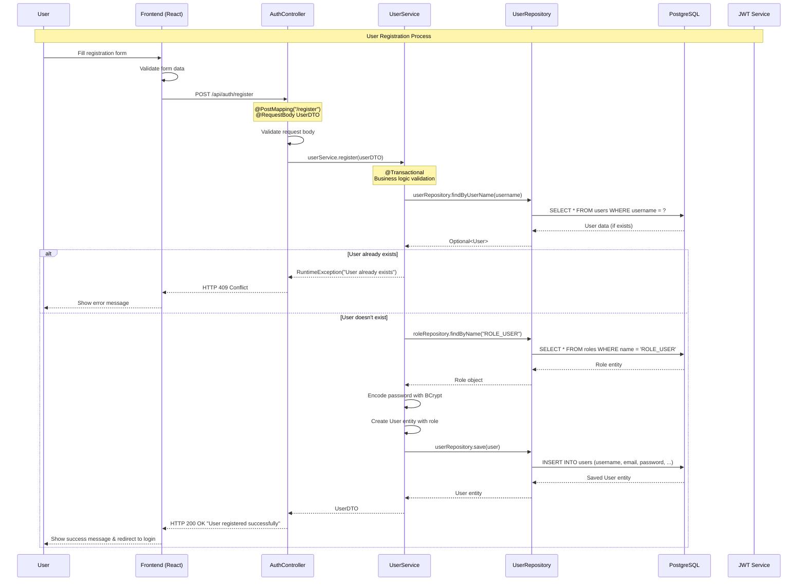
```mermaid
sequenceDiagram
    participant U as User
    participant F as Frontend (React)
    participant C as AuthController
    participant S as UserService
    participant R as UserRepository
    participant DB as PostgreSQL
    participant J as JWT Service

    Note over U,J: User Registration Process
    U->>F: Fill registration form
    F->>F: Validate form data
    F->>C: POST /api/auth/register
    Note over C: @PostMapping("/register")<br/>@RequestBody UserDTO
    
    C->>C: Validate request body
    C->>S: userService.register(userDTO)
    Note over S: @Transactional<br/>Business logic validation
    
    S->>R: userRepository.findByUserName(username)
    R->>DB: SELECT * FROM users WHERE username = ?
    DB-->>R: User data (if exists)
    R-->>S: Optional<User>
    
    alt User already exists
        S-->>C: RuntimeException("User already exists")
        C-->>F: HTTP 409 Conflict
        F-->>U: Show error message
    else User doesn't exist
        S->>R: roleRepository.findByName("ROLE_USER")
        R->>DB: SELECT * FROM roles WHERE name = 'ROLE_USER'
        DB-->>R: Role entity
        R-->>S: Role object
        
        S->>S: Encode password with BCrypt
        S->>S: Create User entity with role
        S->>R: userRepository.save(user)
        R->>DB: INSERT INTO users (username, email, password, ...)
        DB-->>R: Saved User entity
        R-->>S: User entity
        S-->>C: UserDTO
        C-->>F: HTTP 200 OK "User registered successfully"
        F-->>U: Show success message & redirect to login
    end
```

### **1.2 User Login Flow**

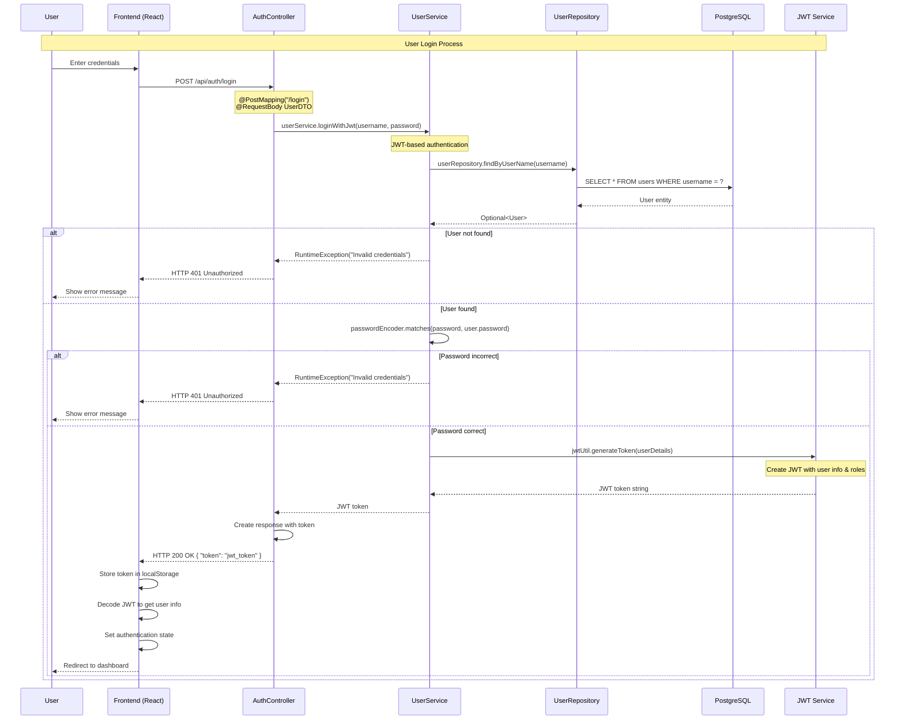
```mermaid
sequenceDiagram
    participant U as User
    participant F as Frontend (React)
    participant C as AuthController
    participant S as UserService
    participant R as UserRepository
    participant DB as PostgreSQL
    participant J as JWT Service

    Note over U,J: User Login Process
    U->>F: Enter credentials
    F->>C: POST /api/auth/login
    Note over C: @PostMapping("/login")<br/>@RequestBody UserDTO
    
    C->>S: userService.loginWithJwt(username, password)
    Note over S: JWT-based authentication
    
    S->>R: userRepository.findByUserName(username)
    R->>DB: SELECT * FROM users WHERE username = ?
    DB-->>R: User entity
    R-->>S: Optional<User>
    
    alt User not found
        S-->>C: RuntimeException("Invalid credentials")
        C-->>F: HTTP 401 Unauthorized
        F-->>U: Show error message
    else User found
        S->>S: passwordEncoder.matches(password, user.password)
        alt Password incorrect
            S-->>C: RuntimeException("Invalid credentials")
            C-->>F: HTTP 401 Unauthorized
            F-->>U: Show error message
        else Password correct
            S->>J: jwtUtil.generateToken(userDetails)
            Note over J: Create JWT with user info & roles
            J-->>S: JWT token string
            S-->>C: JWT token
            C->>C: Create response with token
            C-->>F: HTTP 200 OK { "token": "jwt_token" }
            F->>F: Store token in localStorage
            F->>F: Decode JWT to get user info
            F->>F: Set authentication state
            F-->>U: Redirect to dashboard
        end
    end
```

### **1.3 OAuth2 Login Flow (Google)**

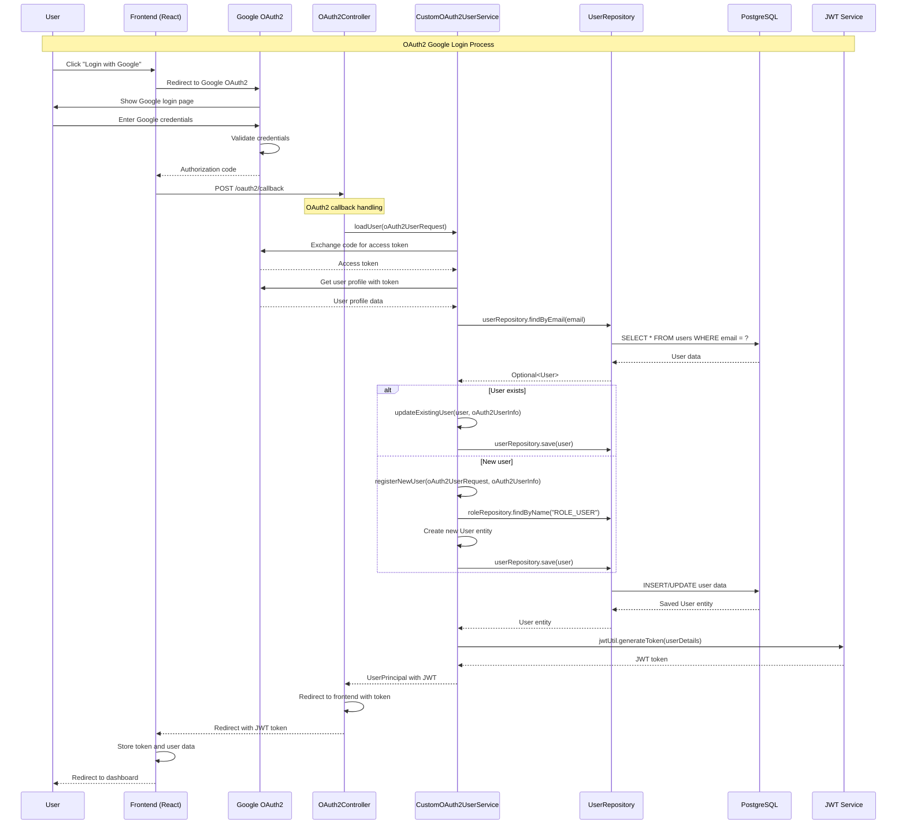
```mermaid
sequenceDiagram
    participant U as User
    participant F as Frontend (React)
    participant G as Google OAuth2
    participant C as OAuth2Controller
    participant S as CustomOAuth2UserService
    participant R as UserRepository
    participant DB as PostgreSQL
    participant J as JWT Service

    Note over U,J: OAuth2 Google Login Process
    U->>F: Click "Login with Google"
    F->>G: Redirect to Google OAuth2
    G->>U: Show Google login page
    U->>G: Enter Google credentials
    G->>G: Validate credentials
    G-->>F: Authorization code
    F->>C: POST /oauth2/callback
    Note over C: OAuth2 callback handling
    
    C->>S: loadUser(oAuth2UserRequest)
    S->>G: Exchange code for access token
    G-->>S: Access token
    S->>G: Get user profile with token
    G-->>S: User profile data
    
    S->>R: userRepository.findByEmail(email)
    R->>DB: SELECT * FROM users WHERE email = ?
    DB-->>R: User data
    R-->>S: Optional<User>
    
    alt User exists
        S->>S: updateExistingUser(user, oAuth2UserInfo)
        S->>R: userRepository.save(user)
    else New user
        S->>S: registerNewUser(oAuth2UserRequest, oAuth2UserInfo)
        S->>R: roleRepository.findByName("ROLE_USER")
        S->>S: Create new User entity
        S->>R: userRepository.save(user)
    end
    
    R->>DB: INSERT/UPDATE user data
    DB-->>R: Saved User entity
    R-->>S: User entity
    S->>J: jwtUtil.generateToken(userDetails)
    J-->>S: JWT token
    S-->>C: UserPrincipal with JWT
    C->>C: Redirect to frontend with token
    C-->>F: Redirect with JWT token
    F->>F: Store token and user data
    F-->>U: Redirect to dashboard
```

---

## 📚 **Flow 2: Book Management**

### **2.1 Book Creation Flow (Admin)**

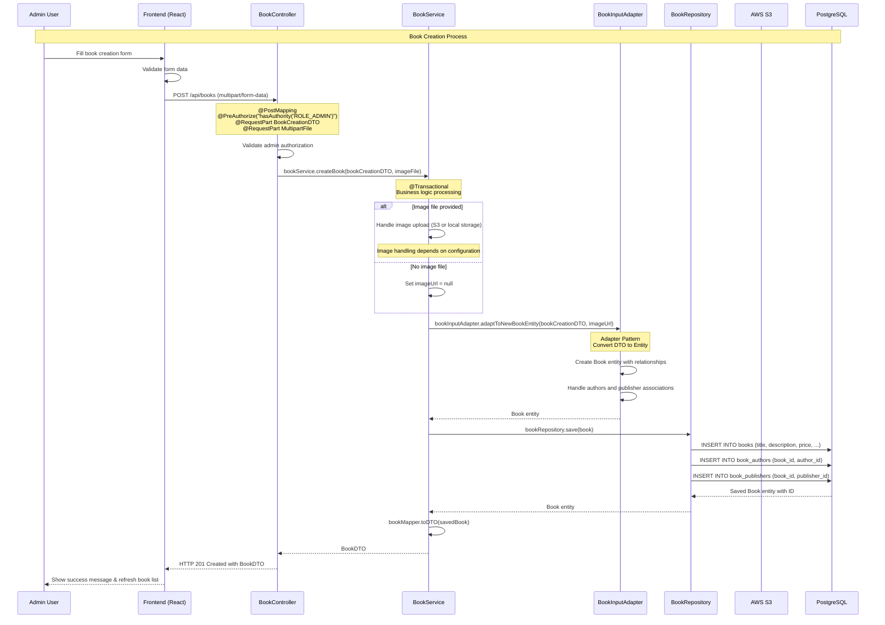
```mermaid
sequenceDiagram
    participant A as Admin User
    participant F as Frontend (React)
    participant C as BookController
    participant S as BookService
    participant AD as BookInputAdapter
    participant R as BookRepository
    participant S3 as AWS S3
    participant DB as PostgreSQL

    Note over A,DB: Book Creation Process
    A->>F: Fill book creation form
    F->>F: Validate form data
    F->>C: POST /api/books (multipart/form-data)
    Note over C: @PostMapping<br/>@PreAuthorize("hasAuthority('ROLE_ADMIN')")<br/>@RequestPart BookCreationDTO<br/>@RequestPart MultipartFile
    
    C->>C: Validate admin authorization
    C->>S: bookService.createBook(bookCreationDTO, imageFile)
    Note over S: @Transactional<br/>Business logic processing
    
    alt Image file provided
        S->>S: Handle image upload (S3 or local storage)
        Note over S: Image handling depends on configuration
    else No image file
        S->>S: Set imageUrl = null
    end
    
    S->>AD: bookInputAdapter.adaptToNewBookEntity(bookCreationDTO, imageUrl)
    Note over AD: Adapter Pattern<br/>Convert DTO to Entity
    AD->>AD: Create Book entity with relationships
    AD->>AD: Handle authors and publisher associations
    AD-->>S: Book entity
    
    S->>R: bookRepository.save(book)
    R->>DB: INSERT INTO books (title, description, price, ...)
    R->>DB: INSERT INTO book_authors (book_id, author_id)
    R->>DB: INSERT INTO book_publishers (book_id, publisher_id)
    DB-->>R: Saved Book entity with ID
    R-->>S: Book entity
    
    S->>S: bookMapper.toDTO(savedBook)
    S-->>C: BookDTO
    C-->>F: HTTP 201 Created with BookDTO
    F-->>A: Show success message & refresh book list
```

### **2.2 Book Search & Filtering Flow**

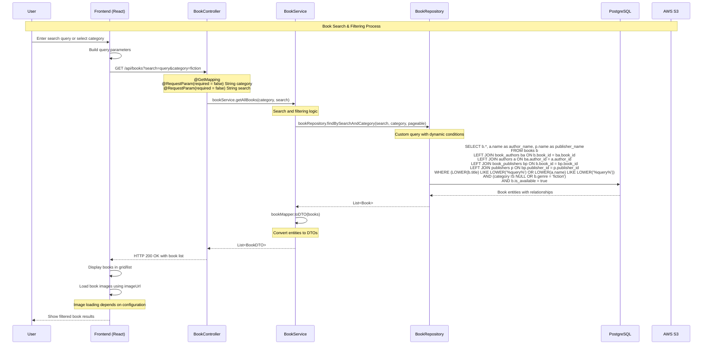
```mermaid
sequenceDiagram
    participant U as User
    participant F as Frontend (React)
    participant C as BookController
    participant S as BookService
    participant R as BookRepository
    participant DB as PostgreSQL
    participant S3 as AWS S3

    Note over U,S3: Book Search & Filtering Process
    U->>F: Enter search query or select category
    F->>F: Build query parameters
    F->>C: GET /api/books?search=query&category=fiction
    Note over C: @GetMapping<br/>@RequestParam(required = false) String category<br/>@RequestParam(required = false) String search
    
    C->>S: bookService.getAllBooks(category, search)
    Note over S: Search and filtering logic
    
    S->>R: bookRepository.findBySearchAndCategory(search, category, pageable)
    Note over R: Custom query with dynamic conditions
    R->>DB: SELECT b.*, a.name as author_name, p.name as publisher_name<br/>FROM books b<br/>LEFT JOIN book_authors ba ON b.book_id = ba.book_id<br/>LEFT JOIN authors a ON ba.author_id = a.author_id<br/>LEFT JOIN book_publishers bp ON b.book_id = bp.book_id<br/>LEFT JOIN publishers p ON bp.publisher_id = p.publisher_id<br/>WHERE (LOWER(b.title) LIKE LOWER('%query%') OR LOWER(a.name) LIKE LOWER('%query%'))<br/>AND (category IS NULL OR b.genre = 'fiction')<br/>AND b.is_available = true
    
    DB-->>R: Book entities with relationships
    R-->>S: List<Book>
    
    S->>S: bookMapper.toDTO(books)
    Note over S: Convert entities to DTOs
    S-->>C: List<BookDTO>
    C-->>F: HTTP 200 OK with book list
    F->>F: Display books in grid/list
    F->>F: Load book images using imageUrl
    Note over F: Image loading depends on configuration
    F-->>U: Show filtered book results
```

---

## 🛒 **Flow 3: Shopping Cart & Order Processing**

### **3.1 Add to Cart Flow**

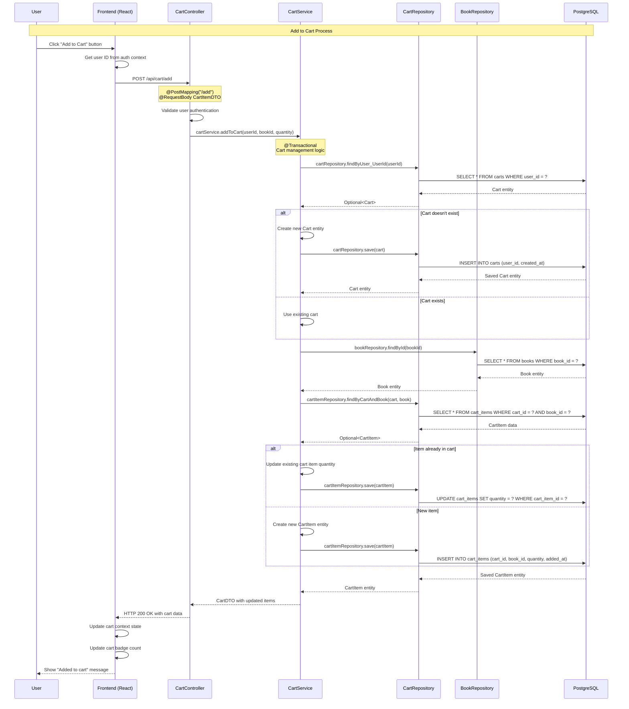
```mermaid
sequenceDiagram
    participant U as User
    participant F as Frontend (React)
    participant C as CartController
    participant S as CartService
    participant R as CartRepository
    participant BR as BookRepository
    participant DB as PostgreSQL

    Note over U,DB: Add to Cart Process
    U->>F: Click "Add to Cart" button
    F->>F: Get user ID from auth context
    F->>C: POST /api/cart/add
    Note over C: @PostMapping("/add")<br/>@RequestBody CartItemDTO
    
    C->>C: Validate user authentication
    C->>S: cartService.addToCart(userId, bookId, quantity)
    Note over S: @Transactional<br/>Cart management logic
    
    S->>R: cartRepository.findByUser_UserId(userId)
    R->>DB: SELECT * FROM carts WHERE user_id = ?
    DB-->>R: Cart entity
    R-->>S: Optional<Cart>
    
    alt Cart doesn't exist
        S->>S: Create new Cart entity
        S->>R: cartRepository.save(cart)
        R->>DB: INSERT INTO carts (user_id, created_at)
        DB-->>R: Saved Cart entity
        R-->>S: Cart entity
    else Cart exists
        S->>S: Use existing cart
    end
    
    S->>BR: bookRepository.findById(bookId)
    BR->>DB: SELECT * FROM books WHERE book_id = ?
    DB-->>BR: Book entity
    BR-->>S: Book entity
    
    S->>R: cartItemRepository.findByCartAndBook(cart, book)
    R->>DB: SELECT * FROM cart_items WHERE cart_id = ? AND book_id = ?
    DB-->>R: CartItem data
    R-->>S: Optional<CartItem>
    
    alt Item already in cart
        S->>S: Update existing cart item quantity
        S->>R: cartItemRepository.save(cartItem)
        R->>DB: UPDATE cart_items SET quantity = ? WHERE cart_item_id = ?
    else New item
        S->>S: Create new CartItem entity
        S->>R: cartItemRepository.save(cartItem)
        R->>DB: INSERT INTO cart_items (cart_id, book_id, quantity, added_at)
    end
    
    DB-->>R: Saved CartItem entity
    R-->>S: CartItem entity
    S-->>C: CartDTO with updated items
    C-->>F: HTTP 200 OK with cart data
    F->>F: Update cart context state
    F->>F: Update cart badge count
    F-->>U: Show "Added to cart" message
```

### **3.2 Order Placement Flow with Saga Pattern**

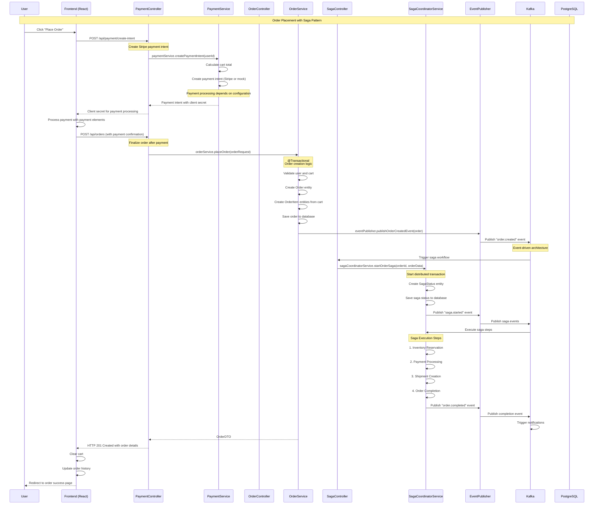
```mermaid
sequenceDiagram
    participant U as User
    participant F as Frontend (React)
    participant PC as PaymentController
    participant PS as PaymentService
    participant OC as OrderController
    participant OS as OrderService
    participant SC as SagaController
    participant SS as SagaCoordinatorService
    participant EP as EventPublisher
    participant K as Kafka
    participant DB as PostgreSQL

    Note over U,DB: Order Placement with Saga Pattern
    U->>F: Click "Place Order"
    F->>PC: POST /api/payment/create-intent
    Note over PC: Create Stripe payment intent
    
    PC->>PS: paymentService.createPaymentIntent(userId)
    PS->>PS: Calculate cart total
    PS->>PS: Create payment intent (Stripe or mock)
    Note over PS: Payment processing depends on configuration
    PS-->>PC: Payment intent with client secret
    PC-->>F: Client secret for payment processing
    
    F->>F: Process payment with payment elements
    F->>PC: POST /api/orders (with payment confirmation)
    Note over PC: Finalize order after payment
    
    PC->>OS: orderService.placeOrder(orderRequest)
    Note over OS: @Transactional<br/>Order creation logic
    
    OS->>OS: Validate user and cart
    OS->>OS: Create Order entity
    OS->>OS: Create OrderItem entities from cart
    OS->>OS: Save order to database
    OS->>EP: eventPublisher.publishOrderCreatedEvent(order)
    
    EP->>K: Publish "order.created" event
    Note over K: Event-driven architecture
    
    K->>SC: Trigger saga workflow
    SC->>SS: sagaCoordinatorService.startOrderSaga(orderId, orderData)
    Note over SS: Start distributed transaction
    
    SS->>SS: Create SagaStatus entity
    SS->>SS: Save saga status to database
    SS->>EP: Publish "saga.started" event
    
    EP->>K: Publish saga events
    K->>SS: Execute saga steps
    
    Note over SS: Saga Execution Steps
    SS->>SS: 1. Inventory Reservation
    SS->>SS: 2. Payment Processing
    SS->>SS: 3. Shipment Creation
    SS->>SS: 4. Order Completion
    
    SS->>EP: Publish "order.completed" event
    EP->>K: Publish completion event
    K->>K: Trigger notifications
    
    OS-->>PC: OrderDTO
    PC-->>F: HTTP 201 Created with order details
    F->>F: Clear cart
    F->>F: Update order history
    F-->>U: Redirect to order success page
```

---

## 💳 **Flow 4: Payment Processing**

### **4.1 Stripe Payment Flow**

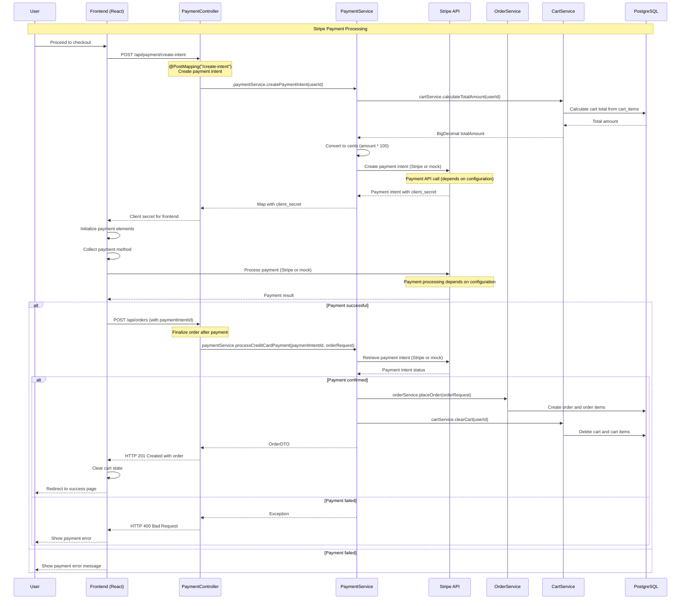
```mermaid
sequenceDiagram
    participant U as User
    participant F as Frontend (React)
    participant PC as PaymentController
    participant PS as PaymentService
    participant S as Stripe API
    participant OS as OrderService
    participant CS as CartService
    participant DB as PostgreSQL

    Note over U,DB: Stripe Payment Processing
    U->>F: Proceed to checkout
    F->>PC: POST /api/payment/create-intent
    Note over PC: @PostMapping("/create-intent")<br/>Create payment intent
    
    PC->>PS: paymentService.createPaymentIntent(userId)
    PS->>CS: cartService.calculateTotalAmount(userId)
    CS->>DB: Calculate cart total from cart_items
    DB-->>CS: Total amount
    CS-->>PS: BigDecimal totalAmount
    
    PS->>PS: Convert to cents (amount * 100)
    PS->>S: Create payment intent (Stripe or mock)
    Note over S: Payment API call (depends on configuration)
    S-->>PS: Payment intent with client_secret
    PS-->>PC: Map with client_secret
    PC-->>F: Client secret for frontend
    
    F->>F: Initialize payment elements
    F->>F: Collect payment method
    F->>S: Process payment (Stripe or mock)
    Note over S: Payment processing depends on configuration
    S-->>F: Payment result
    
    alt Payment successful
        F->>PC: POST /api/orders (with paymentIntentId)
        Note over PC: Finalize order after payment
        
        PC->>PS: paymentService.processCreditCardPayment(paymentIntentId, orderRequest)
        PS->>S: Retrieve payment intent (Stripe or mock)
        S-->>PS: Payment intent status
        
        alt Payment confirmed
            PS->>OS: orderService.placeOrder(orderRequest)
            OS->>DB: Create order and order items
            PS->>CS: cartService.clearCart(userId)
            CS->>DB: Delete cart and cart items
            
            PS-->>PC: OrderDTO
            PC-->>F: HTTP 201 Created with order
            F->>F: Clear cart state
            F-->>U: Redirect to success page
        else Payment failed
            PS-->>PC: Exception
            PC-->>F: HTTP 400 Bad Request
            F-->>U: Show payment error
        end
    else Payment failed
        F-->>U: Show payment error message
    end
```

---

## 🔔 **Flow 5: Real-time Notifications**

### **5.1 WebSocket Notification Flow**

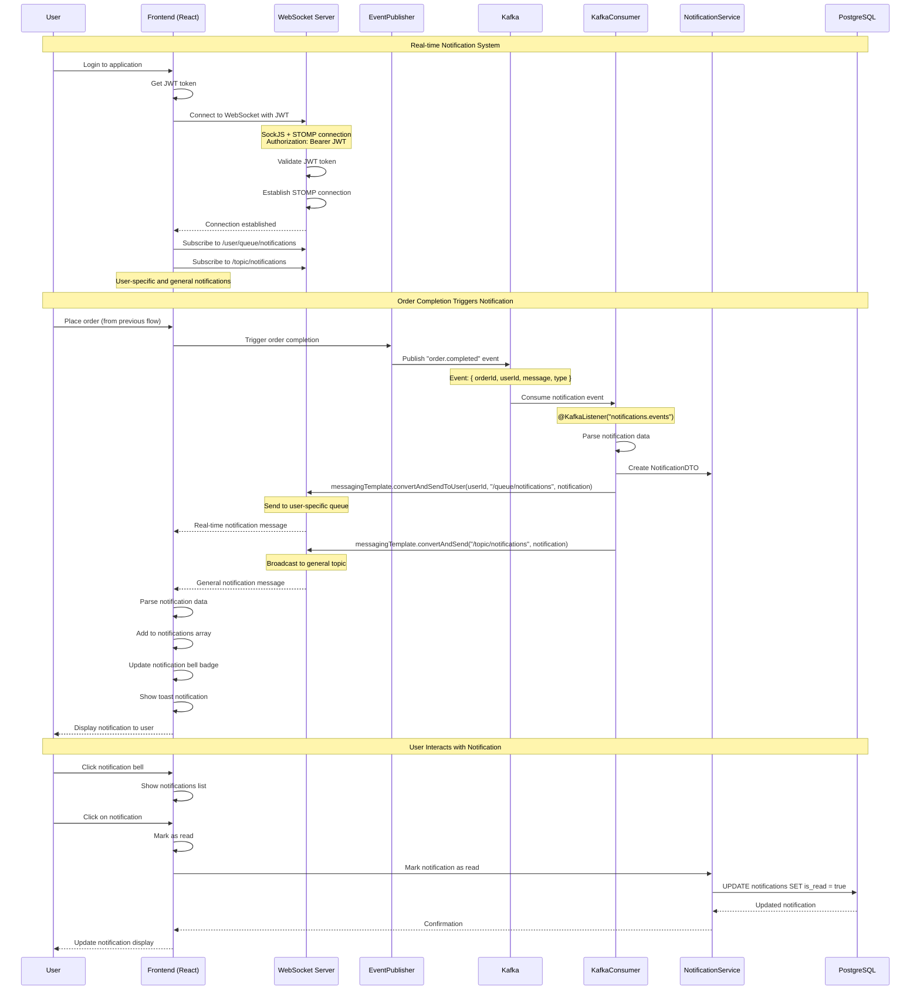
```mermaid
sequenceDiagram
    participant U as User
    participant F as Frontend (React)
    participant WS as WebSocket Server
    participant EP as EventPublisher
    participant K as Kafka
    participant KC as KafkaConsumer
    participant NS as NotificationService
    participant DB as PostgreSQL

    Note over U,DB: Real-time Notification System
    U->>F: Login to application
    F->>F: Get JWT token
    F->>WS: Connect to WebSocket with JWT
    Note over WS: SockJS + STOMP connection<br/>Authorization: Bearer JWT
    
    WS->>WS: Validate JWT token
    WS->>WS: Establish STOMP connection
    WS-->>F: Connection established
    
    F->>WS: Subscribe to /user/queue/notifications
    F->>WS: Subscribe to /topic/notifications
    Note over F: User-specific and general notifications
    
    Note over U,DB: Order Completion Triggers Notification
    U->>F: Place order (from previous flow)
    F->>EP: Trigger order completion
    EP->>K: Publish "order.completed" event
    Note over K: Event: { orderId, userId, message, type }
    
    K->>KC: Consume notification event
    Note over KC: @KafkaListener("notifications.events")
    KC->>KC: Parse notification data
    KC->>NS: Create NotificationDTO
    
    KC->>WS: messagingTemplate.convertAndSendToUser(userId, "/queue/notifications", notification)
    Note over WS: Send to user-specific queue
    WS-->>F: Real-time notification message
    
    KC->>WS: messagingTemplate.convertAndSend("/topic/notifications", notification)
    Note over WS: Broadcast to general topic
    WS-->>F: General notification message
    
    F->>F: Parse notification data
    F->>F: Add to notifications array
    F->>F: Update notification bell badge
    F->>F: Show toast notification
    F-->>U: Display notification to user
    
    Note over U,DB: User Interacts with Notification
    U->>F: Click notification bell
    F->>F: Show notifications list
    U->>F: Click on notification
    F->>F: Mark as read
    F->>NS: Mark notification as read
    NS->>DB: UPDATE notifications SET is_read = true
    DB-->>NS: Updated notification
    NS-->>F: Confirmation
    F-->>U: Update notification display
```

---

## 🎯 **Flow 6: Admin Operations**

### **6.1 Admin Book Management Flow**

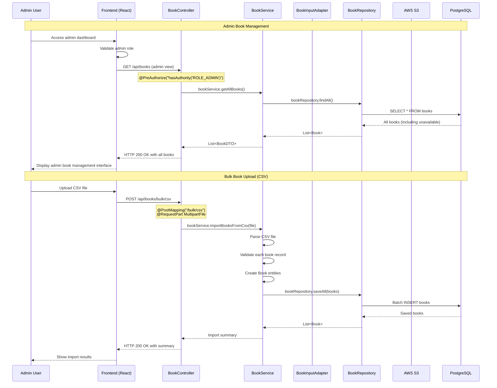
```mermaid
sequenceDiagram
    participant A as Admin User
    participant F as Frontend (React)
    participant C as BookController
    participant S as BookService
    participant AD as BookInputAdapter
    participant R as BookRepository
    participant S3 as AWS S3
    participant DB as PostgreSQL

    Note over A,DB: Admin Book Management
    A->>F: Access admin dashboard
    F->>F: Validate admin role
    F->>C: GET /api/books (admin view)
    Note over C: @PreAuthorize("hasAuthority('ROLE_ADMIN')")
    
    C->>S: bookService.getAllBooks()
    S->>R: bookRepository.findAll()
    R->>DB: SELECT * FROM books
    DB-->>R: All books (including unavailable)
    R-->>S: List<Book>
    S-->>C: List<BookDTO>
    C-->>F: HTTP 200 OK with all books
    F-->>A: Display admin book management interface
    
    Note over A,DB: Bulk Book Upload (CSV)
    A->>F: Upload CSV file
    F->>C: POST /api/books/bulk/csv
    Note over C: @PostMapping("/bulk/csv")<br/>@RequestPart MultipartFile
    
    C->>S: bookService.importBooksFromCsv(file)
    S->>S: Parse CSV file
    S->>S: Validate each book record
    S->>S: Create Book entities
    S->>R: bookRepository.saveAll(books)
    R->>DB: Batch INSERT books
    DB-->>R: Saved books
    R-->>S: List<Book>
    S-->>C: Import summary
    C-->>F: HTTP 200 OK with summary
    F-->>A: Show import results
```

### **6.2 Admin User Management Flow**

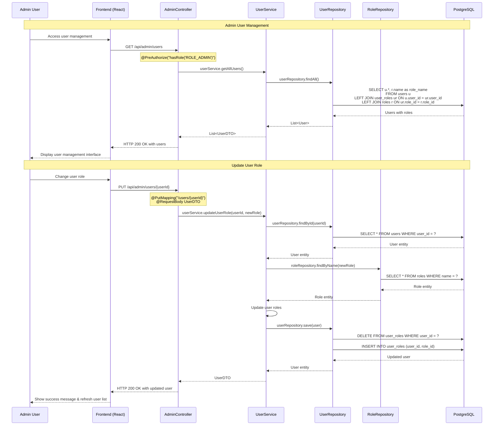
```mermaid
sequenceDiagram
    participant A as Admin User
    participant F as Frontend (React)
    participant C as AdminController
    participant S as UserService
    participant R as UserRepository
    participant RR as RoleRepository
    participant DB as PostgreSQL

    Note over A,DB: Admin User Management
    A->>F: Access user management
    F->>C: GET /api/admin/users
    Note over C: @PreAuthorize("hasRole('ROLE_ADMIN')")
    
    C->>S: userService.getAllUsers()
    S->>R: userRepository.findAll()
    R->>DB: SELECT u.*, r.name as role_name<br/>FROM users u<br/>LEFT JOIN user_roles ur ON u.user_id = ur.user_id<br/>LEFT JOIN roles r ON ur.role_id = r.role_id
    DB-->>R: Users with roles
    R-->>S: List<User>
    S-->>C: List<UserDTO>
    C-->>F: HTTP 200 OK with users
    F-->>A: Display user management interface
    
    Note over A,DB: Update User Role
    A->>F: Change user role
    F->>C: PUT /api/admin/users/{userId}
    Note over C: @PutMapping("/users/{userId}")<br/>@RequestBody UserDTO
    
    C->>S: userService.updateUserRole(userId, newRole)
    S->>R: userRepository.findById(userId)
    R->>DB: SELECT * FROM users WHERE user_id = ?
    DB-->>R: User entity
    R-->>S: User entity
    
    S->>RR: roleRepository.findByName(newRole)
    RR->>DB: SELECT * FROM roles WHERE name = ?
    DB-->>RR: Role entity
    RR-->>S: Role entity
    
    S->>S: Update user roles
    S->>R: userRepository.save(user)
    R->>DB: DELETE FROM user_roles WHERE user_id = ?
    R->>DB: INSERT INTO user_roles (user_id, role_id)
    DB-->>R: Updated user
    R-->>S: User entity
    S-->>C: UserDTO
    C-->>F: HTTP 200 OK with updated user
    F-->>A: Show success message & refresh user list
```

---

## 🔄 **Flow 7: Order Processing Implementation**

### **7.1 Simple Order Processing Flow**

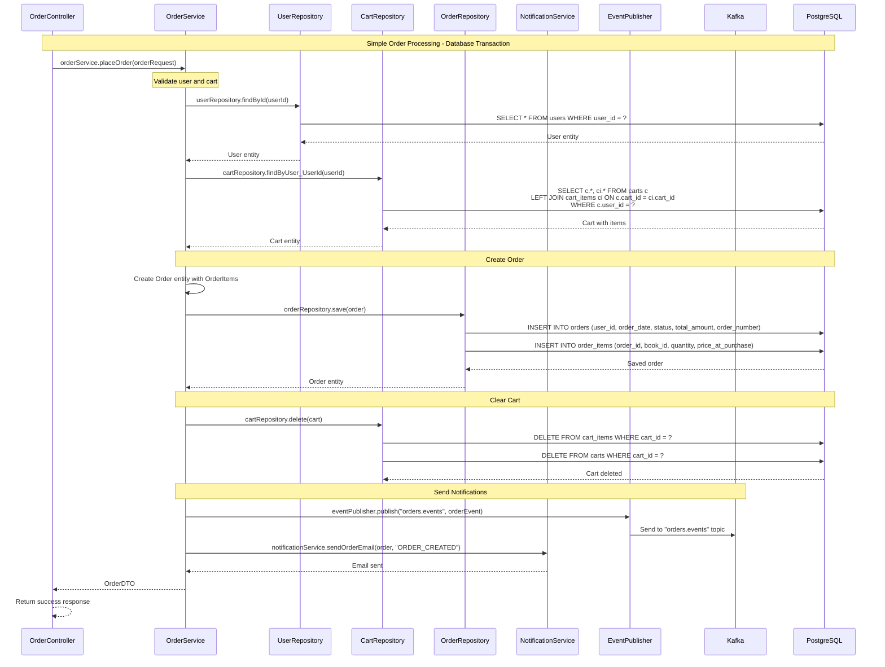
```mermaid
sequenceDiagram
    participant OC as OrderController
    participant OS as OrderService
    participant UR as UserRepository
    participant CR as CartRepository
    participant OR as OrderRepository
    participant NS as NotificationService
    participant EP as EventPublisher
    participant K as Kafka
    participant DB as PostgreSQL

    Note over OC,DB: Simple Order Processing - Database Transaction
    OC->>OS: orderService.placeOrder(orderRequest)
    Note over OS: Validate user and cart
    
    OS->>UR: userRepository.findById(userId)
    UR->>DB: SELECT * FROM users WHERE user_id = ?
    DB-->>UR: User entity
    UR-->>OS: User entity
    
    OS->>CR: cartRepository.findByUser_UserId(userId)
    CR->>DB: SELECT c.*, ci.* FROM carts c<br/>LEFT JOIN cart_items ci ON c.cart_id = ci.cart_id<br/>WHERE c.user_id = ?
    DB-->>CR: Cart with items
    CR-->>OS: Cart entity
    
    Note over OS,DB: Create Order
    OS->>OS: Create Order entity with OrderItems
    OS->>OR: orderRepository.save(order)
    OR->>DB: INSERT INTO orders (user_id, order_date, status, total_amount, order_number)
    OR->>DB: INSERT INTO order_items (order_id, book_id, quantity, price_at_purchase)
    DB-->>OR: Saved order
    OR-->>OS: Order entity
    
    Note over OS,DB: Clear Cart
    OS->>CR: cartRepository.delete(cart)
    CR->>DB: DELETE FROM cart_items WHERE cart_id = ?
    CR->>DB: DELETE FROM carts WHERE cart_id = ?
    DB-->>CR: Cart deleted
    
    Note over OS,K: Send Notifications
    OS->>EP: eventPublisher.publish("orders.events", orderEvent)
    EP->>K: Send to "orders.events" topic
    OS->>NS: notificationService.sendOrderEmail(order, "ORDER_CREATED")
    NS-->>OS: Email sent
    
    OS-->>OC: OrderDTO
    OC-->>OC: Return success response
```

### **7.2 Order Status Update Flow**

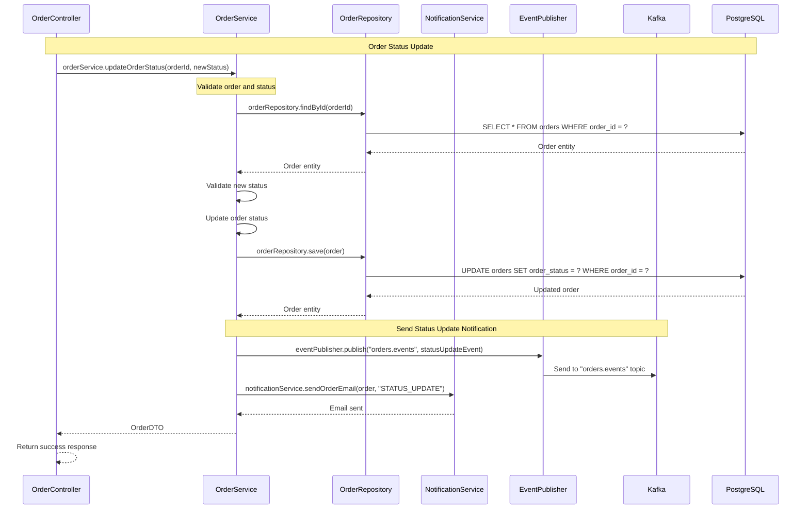
```mermaid
sequenceDiagram
    participant OC as OrderController
    participant OS as OrderService
    participant OR as OrderRepository
    participant NS as NotificationService
    participant EP as EventPublisher
    participant K as Kafka
    participant DB as PostgreSQL

    Note over OC,DB: Order Status Update
    OC->>OS: orderService.updateOrderStatus(orderId, newStatus)
    Note over OS: Validate order and status
    
    OS->>OR: orderRepository.findById(orderId)
    OR->>DB: SELECT * FROM orders WHERE order_id = ?
    DB-->>OR: Order entity
    OR-->>OS: Order entity
    
    OS->>OS: Validate new status
    OS->>OS: Update order status
    OS->>OR: orderRepository.save(order)
    OR->>DB: UPDATE orders SET order_status = ? WHERE order_id = ?
    DB-->>OR: Updated order
    OR-->>OS: Order entity
    
    Note over OS,K: Send Status Update Notification
    OS->>EP: eventPublisher.publish("orders.events", statusUpdateEvent)
    EP->>K: Send to "orders.events" topic
    OS->>NS: notificationService.sendOrderEmail(order, "STATUS_UPDATE")
    NS-->>OS: Email sent
    
    OS-->>OC: OrderDTO
    OC-->>OC: Return success response
```

---

## 📊 **Flow 8: Data Flow Architecture**

### **8.1 Complete Request-Response Flow**

```
┌─────────────────────────────────────────────────────────────────────────────────┐
│                              REQUEST FLOW DIAGRAM                              │
├─────────────────────────────────────────────────────────────────────────────────┤
│                                                                                 │
│  🌐 Frontend Request                                                           │
│  ├── User Action (Click, Form Submit)                                          │
│  ├── Context API State Update                                                  │
│  ├── API Service Call (Axios)                                                  │
│  └── HTTP Request with JWT Token                                               │
│           │                                                                     │
│           ▼                                                                     │
│  🔒 Security Layer                                                             │
│  ├── JWT Request Filter                                                        │
│  ├── Token Validation                                                          │
│  ├── User Authentication                                                       │
│  ├── Role-based Authorization                                                  │
│  └── CORS Configuration                                                        │
│           │                                                                     │
│           ▼                                                                     │
│  🎯 Controller Layer                                                           │
│  ├── @RestController Endpoint                                                  │
│  ├── @RequestMapping Path Mapping                                              │
│  ├── @RequestBody/@RequestParam Validation                                     │
│  ├── @PreAuthorize Security Checks                                             │
│  └── Exception Handling                                                        │
│           │                                                                     │
│           ▼                                                                     │
│  🔧 Service Layer                                                              │
│  ├── Business Logic Processing                                                 │
│  ├── @Transactional Management                                                 │
│  ├── Data Validation & Transformation                                          │
│  ├── External Service Integration                                              │
│  └── Event Publishing                                                          │
│           │                                                                     │
│           ▼                                                                     │
│  📊 Repository Layer                                                           │
│  ├── Spring Data JPA Interface                                                │
│  ├── Custom Query Methods                                                      │
│  ├── Entity Relationship Management                                            │
│  └── Database Transaction Management                                           │
│           │                                                                     │
│           ▼                                                                     │
│  🗄️ Database Layer                                                             │
│  ├── PostgreSQL Database                                                       │
│  ├── Entity Persistence                                                        │
│  ├── Relationship Mapping                                                      │
│  └── ACID Transaction Support                                                  │
│           │                                                                     │
│           ▼                                                                     │
│  🔄 Event-Driven Layer                                                         │
│  ├── Kafka Event Publishing                                                    │
│  ├── Event Consumer Processing                                                 │
│  ├── Saga Pattern Coordination                                                 │
│  └── Compensation Logic                                                        │
│           │                                                                     │
│           ▼                                                                     │
│  📡 External Services                                                          │
│  ├── AWS S3 File Storage                                                       │
│  ├── Stripe Payment Processing                                                 │
│  ├── Google OAuth2 Authentication                                              │
│  └── Email Service Integration                                                 │
│           │                                                                     │
│           ▼                                                                     │
│  📱 Real-time Layer                                                            │
│  ├── WebSocket Server (STOMP)                                                  │
│  ├── Real-time Notification Broadcasting                                       │
│  ├── User-specific Message Queues                                              │
│  └── Live Updates to Frontend                                                  │
│           │                                                                     │
│           ▼                                                                     │
│  🌐 Frontend Response                                                          │
│  ├── HTTP Response Processing                                                  │
│  ├── Context API State Update                                                  │
│  ├── UI Component Re-rendering                                                 │
│  ├── Real-time Notification Display                                            │
│  └── User Feedback & Navigation                                                │
│                                                                                 │
└─────────────────────────────────────────────────────────────────────────────────┘
```

### **8.2 Data Transformation Flow**

```
┌─────────────────────────────────────────────────────────────────────────────────┐
│                            DATA TRANSFORMATION FLOW                            │
├─────────────────────────────────────────────────────────────────────────────────┤
│                                                                                 │
│  📥 Input Data                                                                 │
│  ├── JSON Request Body                                                         │
│  ├── Form Data (multipart/form-data)                                           │
│  ├── Query Parameters                                                          │
│  └── Path Variables                                                            │
│           │                                                                     │
│           ▼                                                                     │
│  🔄 DTO Layer                                                                  │
│  ├── Request DTOs (BookCreationDTO, UserDTO)                                   │
│  ├── Response DTOs (BookDTO, OrderDTO)                                         │
│  ├── Validation Annotations (@NotBlank, @Min)                                  │
│  └── Data Transfer Object Mapping                                              │
│           │                                                                     │
│           ▼                                                                     │
│  🏗️ Entity Layer                                                               │
│  ├── JPA Entities (Book, User, Order)                                          │
│  ├── Entity Relationships (@OneToMany, @ManyToMany)                            │
│  ├── Database Mapping (@Entity, @Table, @Column)                              │
│  └── Business Logic Methods                                                    │
│           │                                                                     │
│           ▼                                                                     │
│  🗄️ Database Schema                                                             │
│  ├── Tables (books, users, orders, cart_items)                                 │
│  ├── Relationships (Foreign Keys)                                              │
│  ├── Indexes (Performance Optimization)                                        │
│  └── Constraints (Data Integrity)                                              │
│           │                                                                     │
│           ▼                                                                     │
│  🔄 Response Transformation                                                    │
│  ├── Entity to DTO Mapping (MapStruct)                                         │
│  ├── JSON Serialization (Jackson)                                              │
│  ├── HTTP Response Body                                                        │
│  └── Status Codes (200, 201, 400, 401, 500)                                   │
│                                                                                 │
└─────────────────────────────────────────────────────────────────────────────────┘
```

---

## 🎯 **Key Design Patterns Used**

### **1. Layered Architecture Pattern**
- **Controller Layer**: Handles HTTP requests and responses
- **Service Layer**: Contains business logic and transaction management
- **Repository Layer**: Handles data access and persistence
- **Entity Layer**: Represents database tables and relationships

### **2. Adapter Pattern**
- **BookInputAdapter**: Converts DTOs to entities with complex relationships
- **OAuth2UserService**: Adapts external OAuth2 user data to internal user model

### **3. Saga Pattern**
- **SagaCoordinatorService**: Manages distributed transactions
- **Compensation Logic**: Handles rollback operations for failed transactions

### **4. Observer Pattern**
- **Event Publishing**: Kafka events for decoupled communication
- **WebSocket Notifications**: Real-time updates to connected clients

### **5. Strategy Pattern**
- **Payment Processing**: Different payment methods (Stripe, Razorpay)
- **Authentication**: Multiple auth strategies (JWT, OAuth2)

---

## 🔧 **Configuration & Security Flow**

### **Security Configuration Flow**

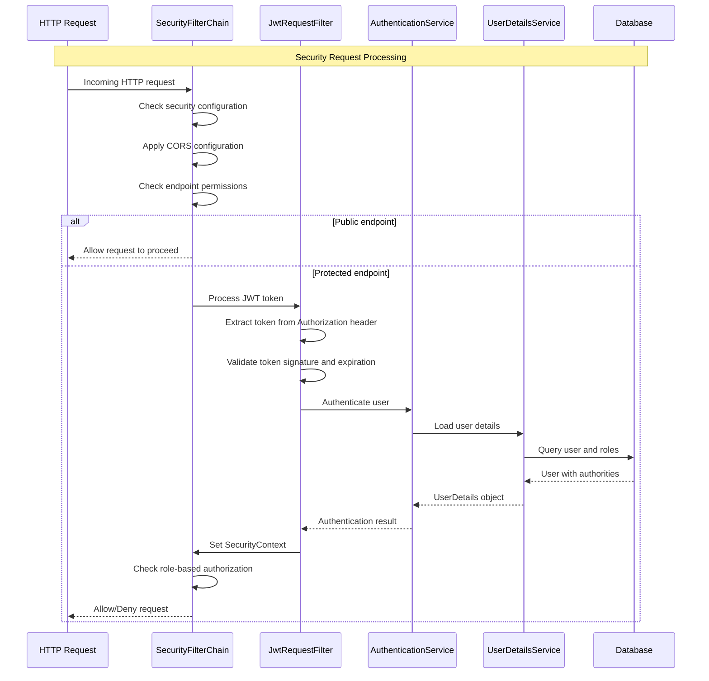
```mermaid
sequenceDiagram
    participant R as HTTP Request
    participant SF as SecurityFilterChain
    participant JF as JwtRequestFilter
    participant AS as AuthenticationService
    participant UDS as UserDetailsService
    participant DB as Database

    Note over R,DB: Security Request Processing
    R->>SF: Incoming HTTP request
    SF->>SF: Check security configuration
    SF->>SF: Apply CORS configuration
    SF->>SF: Check endpoint permissions
    
    alt Public endpoint
        SF-->>R: Allow request to proceed
    else Protected endpoint
        SF->>JF: Process JWT token
        JF->>JF: Extract token from Authorization header
        JF->>JF: Validate token signature and expiration
        JF->>AS: Authenticate user
        AS->>UDS: Load user details
        UDS->>DB: Query user and roles
        DB-->>UDS: User with authorities
        UDS-->>AS: UserDetails object
        AS-->>JF: Authentication result
        JF->>SF: Set SecurityContext
        SF->>SF: Check role-based authorization
        SF-->>R: Allow/Deny request
    end
```

---

## 📈 **Performance Optimization Flows**

### **Caching Strategy Flow**

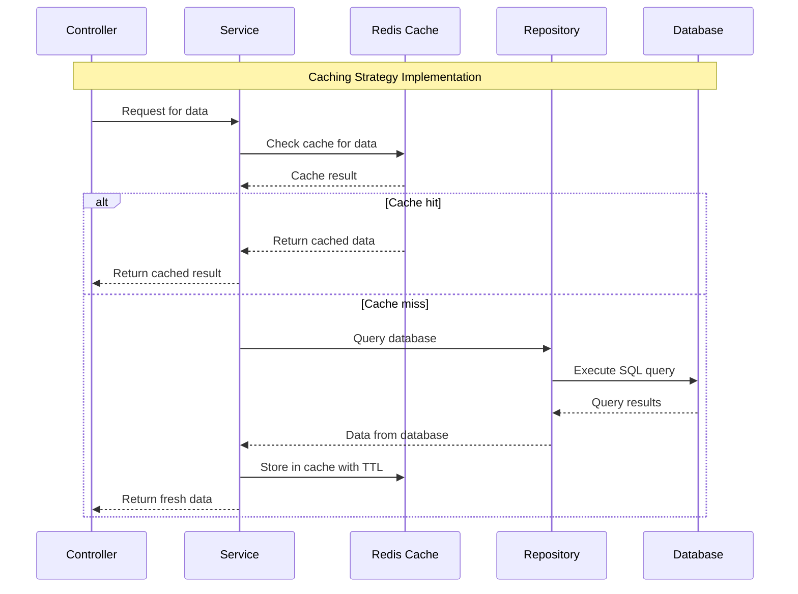
```mermaid
sequenceDiagram
    participant C as Controller
    participant S as Service
    participant Cache as Redis Cache
    participant R as Repository
    participant DB as Database

    Note over C,DB: Caching Strategy Implementation
    C->>S: Request for data
    S->>Cache: Check cache for data
    Cache-->>S: Cache result
    
    alt Cache hit
        Cache-->>S: Return cached data
        S-->>C: Return cached result
    else Cache miss
        S->>R: Query database
        R->>DB: Execute SQL query
        DB-->>R: Query results
        R-->>S: Data from database
        S->>Cache: Store in cache with TTL
        S-->>C: Return fresh data
    end
```

---

## 🎯 **Summary**

This comprehensive user flow documentation covers:

1. **Authentication Flows**: Registration, login, and OAuth2 integration
2. **Book Management**: Creation, search, and filtering operations
3. **Shopping Cart**: Add to cart and cart management
4. **Order Processing**: Complete order placement with Saga pattern
5. **Payment Processing**: Stripe integration and payment flow
6. **Real-time Notifications**: WebSocket and Kafka-based notifications
7. **Admin Operations**: User and book management for administrators
8. **Saga Pattern**: Distributed transaction management with compensation
9. **Security**: JWT, OAuth2, and role-based access control
10. **Performance**: Caching strategies and optimization techniques

Each flow includes detailed sequence diagrams, code examples, and explanations of the data transformations that occur at each layer of the application architecture.

---

<div align="center">
  <strong>📚 BookStore Application - Complete User Flow Documentation</strong><br>
  <em>Understanding every request from frontend to database and back</em>
</div>
